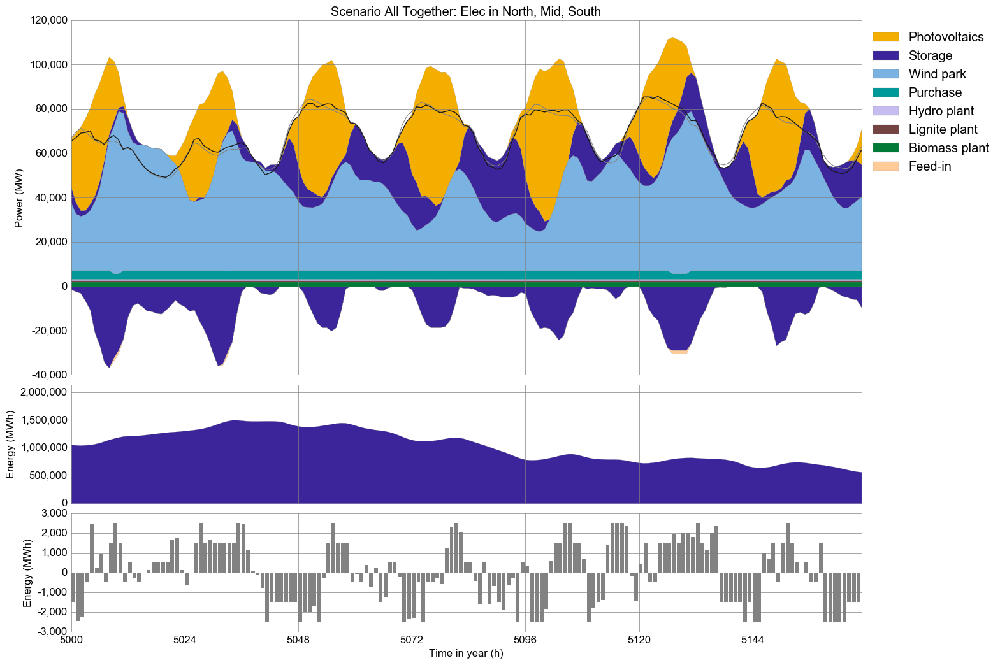

# SEED Himalaya Project - URBS Website

This repository contains a fully functional website that allows to run the linear programming optimization framework urbs. The data contained focuses on Northern India and the Himalayas, contributing to the [Seed Himalaya Project](https://www.wasser.tum.de/en/nexus/research-projects/seed-himalaya/). The aim of this website is to provide accessibility to the urbs framework for non-experts. The website allows a user, with little or no background knowledge and data, to run urbs. The website is self-explanatory, being based on drop-down lists, drag-and-drop, and a basic map module to select the user's location.

# URBS

urbs is a [linear programming](https://en.wikipedia.org/wiki/Linear_programming) optimization framework for capacity expansion planning and unit commitment for distributed energy systems. Its name, latin for city, stems from its origin as a model for the optimization of urban energy systems. Since then, it has been adapted to multiple scales from neighborhoods to continents.

## Features

  * urbs is a linear programming model for multi-commodity energy systems with a focus on optimal storage sizing and use.
  * It finds the minimum cost energy system to satisfy the given demand time  series for possibly multiple commodities (e.g. electricity).
  * By default, operates on hourly-spaced time steps (configurable).
  * Thanks to [Pandas](https://pandas.pydata.org), complex data analysis is easy.
  * The model itself is quite small thanks to relying on package [Pyomo](http://www.pyomo.org/).
  * The small codebase includes reporting and plotting functionality.

## Screenshots

## Installation

There are 2 ways to get all required packages under Windows. We recommend using the Python distribution Anaconda. If you don't want to use it or already have an existing Python (this repository was developed and tested for Python 3.8.5) installation, you can also download the required packages by yourself..

### Anaconda/Miniconda (recommended)

  1. **[Anaconda (Python 3)](http://continuum.io/downloads)/[Miniconda](https://docs.conda.io/en/latest/miniconda.html)**. Choose the 64-bit installer if possible.
     During the installation procedure, keep both checkboxes "modify PATH" and "register Python" selected! If only higher Python versions are available, you can switch to a specific Python Version by typing `conda install python=<version>`
  2. **Packages and Solver**: [GLPK](http://winglpk.sourceforge.net/).
     1. Download the [environment file](https://github.com/julianmachnitzke/seed-urbs/seed_urbs.yml).
     2. Launch a new command prompt (Windows: Win+R, type "cmd", Enter)
     3. Install it via conda by `conda env create -f seed_urbs.yml`.
     4. Each time you open a new terminal for running urbs, you can activate the environment by `conda activate urbs`.

### Manually (the hard way)

For all packages, best take the release as given in the environment file. The list of packages can be found in the [environment file](https://github.com/julianmachnitzke/seed-urbs/seed_urbs.yml).
  
## Get started

To launch the website, once all required packages are installed, the user can navigate to the folder where the website is saved by typing `cd \path\to\your\folder`. Once redirected to the correct folder the website can be launched by typing `python app.py` into the anaconda console.
The website is now running on a local host. In a browser the website can hence be accessed by navigating to 'http://127.0.0.1:5000'.

## Next steps and tips

  1. Head over to the tutorial at http://urbs.readthedocs.io, which goes through runme.py step by step. This will also help to understand this website. 
  2. Read the source code of `runme.py` and `comp.py`. 
  3. Try adding/modifying scenarios in `scenarios.py` and see their effect on results.
  4. Read the source code of the `app.py` file. Here also changes e.g. in the creation of the potential hydro energy (lines 464 to 493) can be commited (for hydro also see [utils.py](https://github.com/julianmachnitzke/seed-urbs/blob/main/static/functions/utils.py) from line 101 onwards).
  
## Further reading
  - For more insights on URBS see the official [URBS GitHub repository](https://learnpythonthehardway.org/book/appendixa.html).
  - If you do not know anything about the command line, read [Command Line Crash Course](https://learnpythonthehardway.org/book/appendixa.html). Python programs are scripts that are executed from the command line, similar to MATLAB scripts that are executed from the MATLAB command prompt.
  - If you do not know Python, try one of the following resources:
    * The official [Python Tutorial](https://docs.python.org/3/tutorial/index.html) walks you through the language's basic features.
    * [Learn Python the Hard Way](https://learnpythonthehardway.org/book/preface.html). It is meant for programming beginners.
  - The book [Python for Data Analysis](http://shop.oreilly.com/product/0636920023784.do) best summarises the capabilities of the packages installed here. It starts with IPython, then adds NumPy, slowly fades to pandas and then shows first basic, then advanced data conversion and analysis recipes. Visualization with matplotlib is given its own chapter, both with and without pandas.
  - For a huge buffet of appetizers showing the capabilities of Python for scientific computing, I recommend browsing this [gallery of interesting IPython Notebooks](https://github.com/ipython/ipython/wiki/A-gallery-of-interesting-IPython-Notebooks).
  

## Copyright

Copyright (C) 2014-2019  TUM ENS

This program is free software: you can redistribute it and/or modify
it under the terms of the GNU General Public License as published by
the Free Software Foundation, either version 3 of the License, or
(at your option) any later version.

This program is distributed in the hope that it will be useful,
but WITHOUT ANY WARRANTY; without even the implied warranty of
MERCHANTABILITY or FITNESS FOR A PARTICULAR PURPOSE.  See the
GNU General Public License for more details.

You should have received a copy of the GNU General Public License
along with this program.  If not, see <http://www.gnu.org/licenses/>